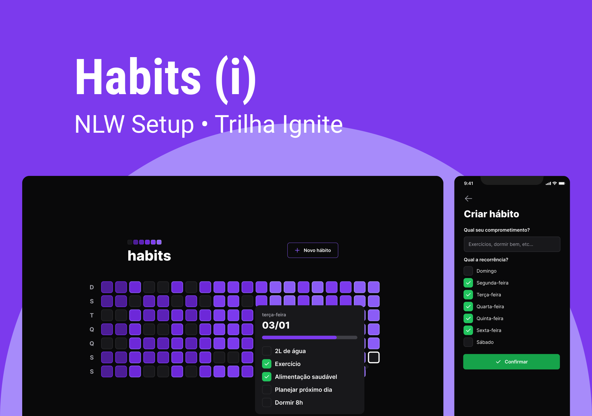
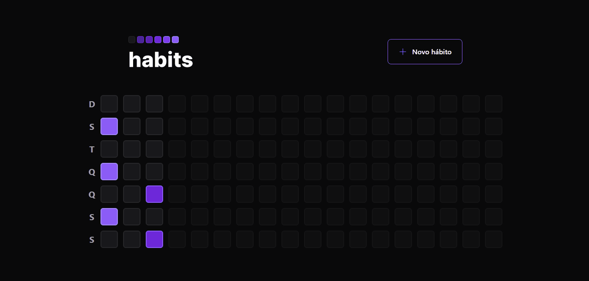

# Habit Tracker 🤘

Rastreador de Hábitos construído durante a NLW Setup na trilha Ignite. Nesse projeto contruímos todo o Back-end da aplicação, assim como toda a interface Web e Mobile.

## 🔧 Tecnologias

    
    
    
    
    
    
    
    
    
    
    

## 💻 Demo

| Versão Web |
| ---------- |
|  |

| Versão Mobile |
| ---------- |
|  |
